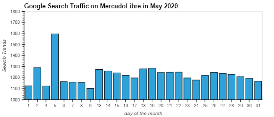
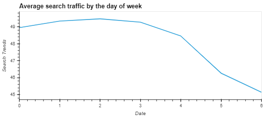
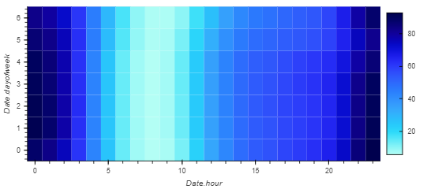
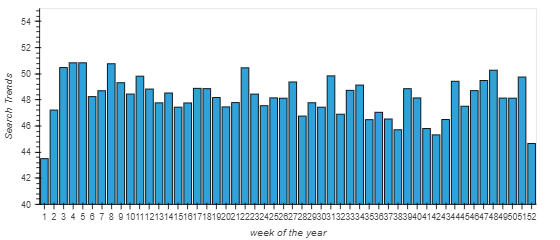
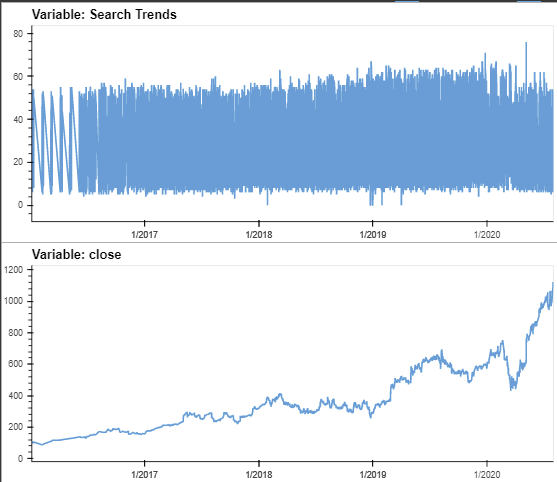
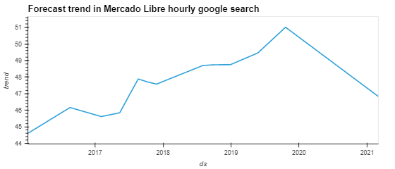

# timeseries-homework

This exercise requires using Google Colab to produce a Jupyter notebook that contains data preparation, analysis (including predictive modelling) and visualisations for all the time series used.

Key objectives of the exercise are:
* Identify patterns in the time series data. We look at three set of time series data:  
1. Google hourly search trends on Mercado Libre from 2016-2020  
2. Mercado Libre hourly stock prices from 2015-2020  
3. Mercado Libre daily sales revenue from 2019-2020  

* Mining for patterns in seasonality by using visualisations  
* building sales-forecast and user-interest predictive models by applying a Prophet forecasting model to the data.

## Findings
### Unusual Patterns in Hourly Google Search Traffic
Mercado Libre announced its first quarter 2020 financial result on the 5th May 2020. On the result announcement day, the number of google search traffic on the company is significantly higher than usual. 

When comparing the total search traffic May 2020 (33101) to the monthly median across all the months (33896), there is no unusual pattern identified. 

### Mine the Search Traffic Data for seasonality
### Day of the week

From the average search traffic by the day of week, we tend to see high search traffic between Tuesday to Thursday and low search traffic on the weekends. 

From the heatmap, we can further observe the searches are concentrated between hours 22-23 and hours 0-1 of the day.

#### Week of the year

During the winter holiday period (weeks 40 through 52), there is an obvious increasing trend between week 42 through 48 and followed by a decreasing trend.

### Relate the search traffic to stock price patterns
**Analysis Period Jan 2020 to Jun 2020**  

In the first quarter 2020, the market was hit with global pandemic shock. We observe a sharp decrease in the stock prices during that time. Subsequent months after March 2020, we observe steady increase month on month. This observation is consistent with the narrative ".. after the initial shock to the global financial markets, new customers and revenue increased for e-commerce platforms."

#### Relationship between lagged search traffic and stock volatility or stock price return

From the correlation matrix, stock volatility is weakly negative correlated with the lagged search trend. There is closed to no correlation between the lagged search traffic and the stock price return. From the correlation coeficients, we can deduce that there is no predictable relationship exist between the lagged search traffic and the stock volatility or between the lagged search traffic and the stock price returns.

### Forecast patterns in the hourly search data

We apply the hourly search data to Prophet forecast data. Using the five years data from 2015-2020, the popularity of Mercado Libre is forecasted to decrease in the near-term.

From the individual time series component of the model,  
* Tuesday gets the most search traffic
* midnight 00:00 hour exhibits the greatest popularity and
* New year day (1 Jan) has the lowest search traffic in the calendar year.

### (Optional) Forecast sales revenue
To forecast the sales revenue for the next quarter (i.e 2020-07-01 to 2020-09-30), we apply the Prophet forecast model to sales data 2019-1H 2020. Based on the forecast information generated, the most likely for the next quarter expected total sales revenue is USD 970m, the best case scenario will be USD 1,051m and the worst case scenario will be USD 888m.
